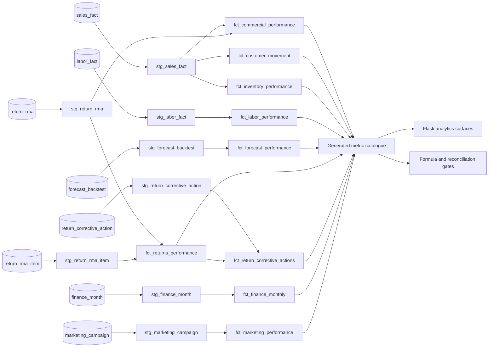

# Northgate governed metric lineage

The public demo runs its application queries on DuckDB and SQLite, while the analytical project below is written in Snowflake-dialect dbt SQL. Both surfaces use the same synthetic source contract. The live metric catalogue is loaded directly from `models/marts/schema.yml`.

## Certification contract

- **Certified:** shared decision metric with a single implementation and cross-page or reconciliation tests.
- **Verified:** governed metric with a declared formula, grain, source, owner, basis, and mart.
- **Diagnostic:** useful supporting signal whose interpretation requires an explicit caveat.
- **Source-gated:** implemented only when the declared source field is populated for the selected scope.
- **Withheld:** definition is documented, but the required source does not exist. The app must render a source requirement rather than a number.

The dbt project parses against the Snowflake adapter in CI. Runtime data remains entirely synthetic.
